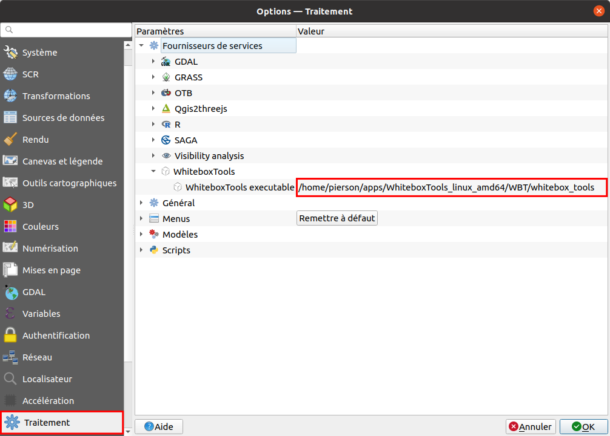
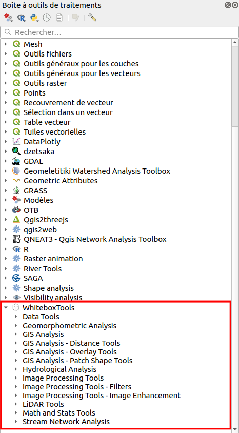
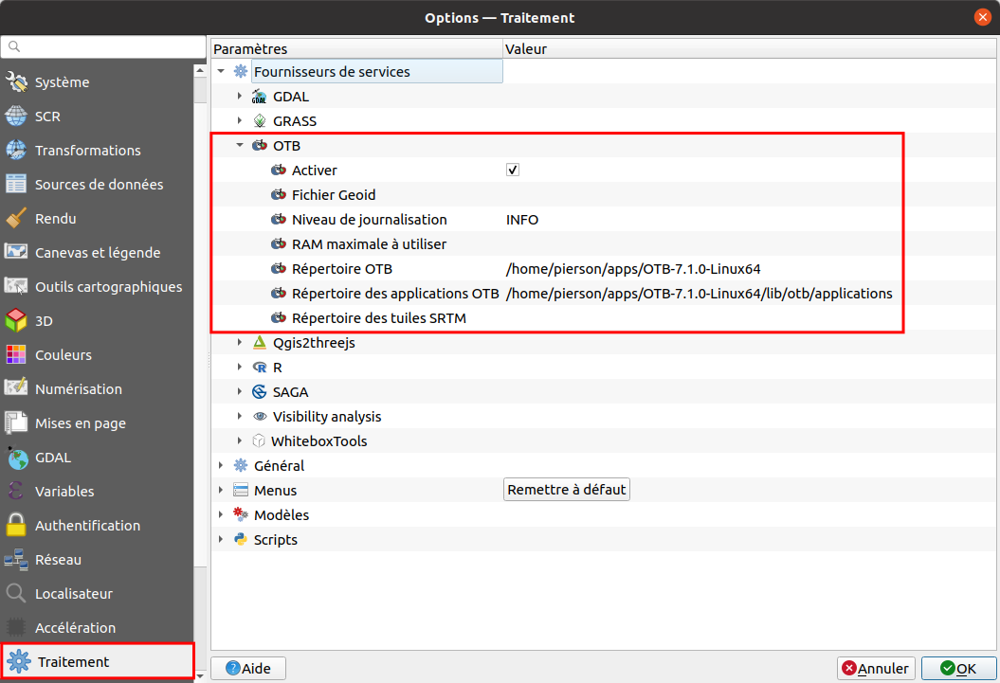
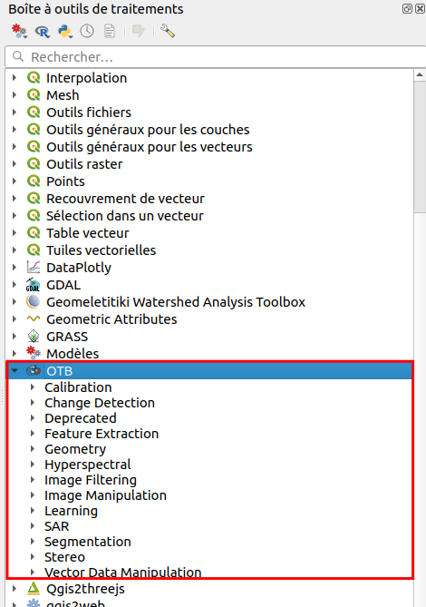

```{r setup, include=FALSE}
knitr::opts_chunk$set(echo = TRUE)
```

## Boostez votre QGIS !

### Installation de plugins

Pour installer la plupart des extensions dans QGIS :

**Menu Extensions ➔ Installer/gérer les extensions**

Si une extension n'est pas dans le dépôt officiel QGIS, on peut la télécharger à la main et la déposer dans le dossier du profil QGIS.

Pour savoir où est ce dossier : **Menu Préférences ➔ Profils utilisateurs ➔ Ouvrir le dossier du profil actif**

Dans ce cas il faut placer l'extension dans le sous-dossier **python/plugins** (qui doit être créé si aucune extension n'est déjà installée)

Liste non exhaustive et subjective de quelques extensions :

- [Data Plotly](https://github.com/ghtmtt/DataPlotly) : visualiser des données sous forme de graphiques (histogrammes, nuages de points...)
- [dzetsaka : Classification tool](https://github.com/nkarasiak/dzetsaka/
) : classification semi-automatique
- [French Locator Filter](https://oslandia.gitlab.io/qgis/french_locator_filter/) et [Nominatim Locator Filter](https://github.com/rduivenvoorde/nominatim_locator_filter) : : zoomer sur des lieux précis en tapant un nom de lieu dans la barre de recherche en bas à gauche, respectivement avec l'API de la BAN et avec Nominatim
- [GéoBretagne](https://github.com/geobretagne/qgis-plugin/wiki) : accéder facilement aux données de Géobretagne (orthophotos, altimétrie, cadastre, limites administratives...)
- [MapSwipe Tool](https://github.com/lmotta/mapswipetool_plugin/wiki) : comparer des rasters, avec une "glissière"
- [mmqgis](http://michaelminn.com/linux/mmqgis) : une collection d'outils avec notamment un outil de géocodage
- [Processing R Provider](https://north-road.github.io/qgis-processing-r) : utiliser des scripts R dans QGIS
- [QGIS Resource sharing](http://qgis-contribution.github.io/QGIS-ResourceSharing/) : récupérer dans une base commune différents types de ressources, comme des styles de couches et des scripts R !
- [QGIS2threejs](https://qgis2threejs.readthedocs.io/en/docs/) : exporter un projet QGIS avec un MNT vers une vue 3D au format HTML, visible dans un navigateur
- [QuickOSM](https://docs.3liz.org/QuickOSM/) : récupérer des données OSM directement dans QGIS
- [RasterTimeseriesManager](https://raster-timeseries-manager.readthedocs.io/) : exploration de séries temporelles d'images satellite (celui-là je ne l'ai pas testé !)
- [SCP-Plugin](https://fromgistors.blogspot.com/p/semi-automatic-classification-plugin.html) : récupérer des images satellite, pré- et post-traitement et classification semi-automatique (ce plugin est pratiquement un logiciel en soi !)


### Les outils Whitebox

[WhiteboxTools](https://jblindsay.github.io/wbt_book/intro.html) est une boîte à outils d'analyse de données spatiales, créée par John Lindsay (Université de Guelph, Canada) en 2017. Elle contient plus de 440 outils, certains "classiques" des SIG mais d'autres plus spécialisés notamment en hydrologie, distance de moindre-coût, traitement de données lidar, traitement de données d'altitude...

Les outils Whitebox peuvent s'utiliser en ligne de commande, à travers des langages tels que Python et R, mais aussi [dans QGIS](https://jblindsay.github.io/wbt_book/qgis_plugin.html). 

3 étapes sont nécessaires pour cela :

1. Télécharger le plugin **WhiteboxTools for Processing**. Ce plugin n'est pas dans le dépôt officiel QGIS, il faut ajouter le dépôt d'Alex Bruy qui se trouve à cette url : `https://plugins.bruy.me/plugins/plugins.xml` (comme indiqué [ici](https://jblindsay.github.io/wbt_book/qgis_plugin.html#installation-of-the-plugin))
2. [Télécharger WhiteboxTools](https://www.whiteboxgeo.com/download-whiteboxtools/) et dézipper le fichier à l'emplacement de votre choix (il ne faudra plus bouger l'application ensuite, donc pas sur le bureau)
3. Activer les outils whitebox dans la boîte à outils de QGIS : **Menu ➔ Options ➔ Traitement ➔ Fournisseurs de services ➔ WhiteboxTools**, pointez vers le fichier **whitebox_tools** là où vous l'avez installé, normalement dans un dossier **WBT**.



Les outils Whitebox sont maintenant accessibles dans la boîte à outils :



Les outils sont documentés sur le site officiel, chapitre [Tools Reference](https://jblindsay.github.io/wbt_book/available_tools/index.html).

### OrfeoToolbox

[L'OrfeoToolbox](https://www.orfeo-toolbox.org/) est une boîte à outil de télédétection développée par le CNES. Ses outils sont accessibles via l'interface graphique Monteverdi, en ligne de commande, à travers les langages Python et C++, et dans QGIS.

Pour [installer l'OrfeoToolbox dans QGIS](https://docs.qgis.org/3.16/en/docs/user_manual/processing/3rdParty.html#otb-applications) :

1. [Télécharger OrfeoToolbox](https://www.orfeo-toolbox.org/download/) et installer le logiciel à un endroit définitif (pas sur le bureau)
2. Activer l'OrfeoToolbox dans la boîte à outils de QGIS : **Menu ➔ Options ➔ Traitement ➔ Fournisseurs de services ➔ OTB**, cocher **Activate**, et pointez vers les bons dossiers pour le répertoire OTB (le dossier "global" de l'application) et pour le répertoire des applications OTB (le sous-dossier /lib/otb/applications)



Les outils OrfeoToolbox sont maintenant accessibles dans la boîte à outils :



L'aide des outils est disponible dans la [documentation](https://www.orfeo-toolbox.org/CookBook/), rubrique [All Applications](https://www.orfeo-toolbox.org/CookBook/Applications.html).

### SAGA

### Ajout de flux de données

## Manipulation de données

### Remplir les valeurs nulles d'un raster par les valeurs d'un autre raster

Données tests : images T1 et T2 de la Petite Charnie, pour faire un mix des 2 images en prenant les valeurs de T1 là où il y a des valeurs nulles pour T2

1. Mettre les 2 images à la même dimension : WhiteboxTools ➔ Resample
2. Remplir les valeurs vides de T2 avec les valeurs de T1, avec WhiteboxTools ➔ UpdateNodataCells


### Statistiques zonales

