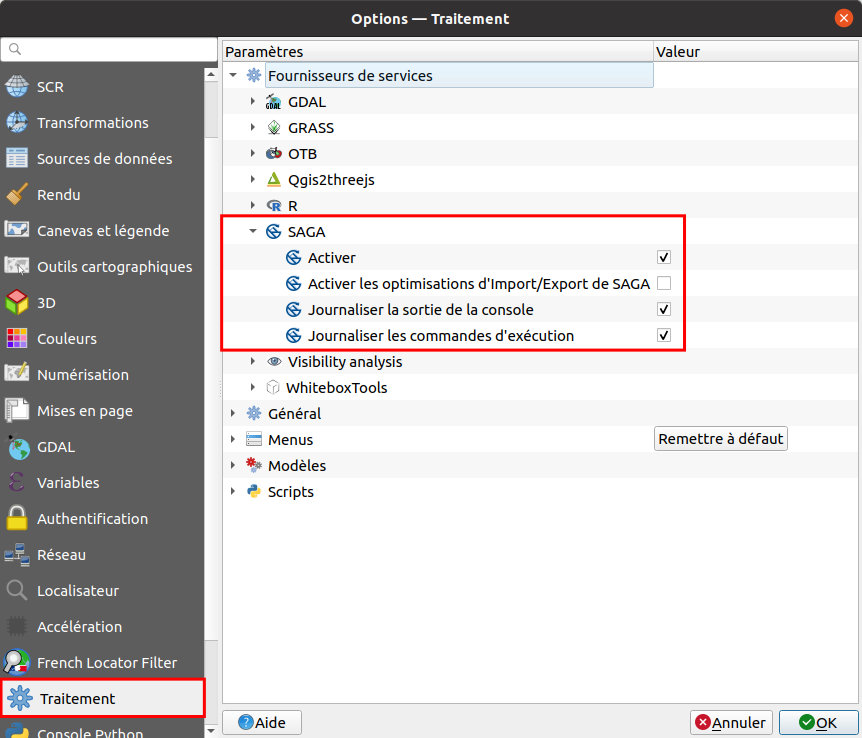
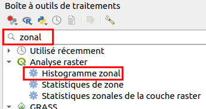

```{r setup, include=FALSE}
knitr::opts_chunk$set(echo = TRUE)
```

## Boostez votre QGIS !

### Installation de plugins

Pour installer la plupart des extensions dans QGIS :

**Menu Extensions → Installer/gérer les extensions**

Si une extension n'est pas dans le dépôt officiel QGIS (cas relativement rare), on peut la télécharger à la main et la déposer dans le dossier du profil QGIS.

Pour savoir où est ce dossier : **Menu Préférences → Profils utilisateurs → Ouvrir le dossier du profil actif**

Dans ce cas il faut placer l'extension dans le sous-dossier **python/plugins** (qui doit être créé si aucune extension n'est déjà installée)

Liste non exhaustive et subjective de quelques extensions :

- [Data Plotly](https://github.com/ghtmtt/DataPlotly) : visualiser des données sous forme de graphiques (histogrammes, nuages de points...)
- [dzetsaka : Classification tool](https://github.com/nkarasiak/dzetsaka/
) : classification semi-automatique
- [French Locator Filter](https://oslandia.gitlab.io/qgis/french_locator_filter/) et [Nominatim Locator Filter](https://github.com/rduivenvoorde/nominatim_locator_filter) : zoomer sur des lieux précis en tapant un nom de lieu dans la barre de recherche en bas à gauche, respectivement avec l'API de la BAN et avec Nominatim
- [GéoBretagne](https://github.com/geobretagne/qgis-plugin/wiki) : accéder facilement aux données de Géobretagne (orthophotos, altimétrie, cadastre, limites administratives...)
- [MapSwipe Tool](https://github.com/lmotta/mapswipetool_plugin/wiki) : comparer des rasters, avec une "glissière"
- [mmqgis](http://michaelminn.com/linux/mmqgis) : une collection d'outils avec notamment un outil de géocodage
- [Processing R Provider](https://north-road.github.io/qgis-processing-r) : utiliser des scripts R dans QGIS
- [QGIS Resource sharing](http://qgis-contribution.github.io/QGIS-ResourceSharing/) : récupérer dans une base commune différents types de ressources, notamment des scripts
- [QGIS2threejs](https://qgis2threejs.readthedocs.io/en/docs/) : exporter un projet QGIS avec un MNT vers une vue 3D au format HTML, visible dans un navigateur
- [QuickOSM](https://docs.3liz.org/QuickOSM/) : récupérer des données OSM directement dans QGIS
- [RasterTimeseriesManager](https://raster-timeseries-manager.readthedocs.io/) : exploration de séries temporelles d'images satellite (celui-là je ne l'ai pas testé)
- [SCP-Plugin](https://fromgistors.blogspot.com/p/semi-automatic-classification-plugin.html) : récupérer des images satellite, pré- et post-traitement et classification semi-automatique (ce plugin est pratiquement un logiciel en soi !)

Des outils d'autres logiciels SIG sont également accessibles via QGIS, notamment ceux de [Grass](https://docs.qgis.org/3.16/en/docs/user_manual/processing/3rdParty.html?highlight=saga#grass) mais aussi, de manière parfois moins connue...

### Les outils Whitebox

[WhiteboxTools](https://jblindsay.github.io/wbt_book/intro.html) est une boîte à outils d'analyse de données spatiales, créée par John Lindsay (Université de Guelph, Canada) en 2017. Elle contient plus de 440 outils, certains "classiques" des SIG mais d'autres plus spécialisés notamment en hydrologie, distance de moindre-coût, traitement de données lidar, traitement de données d'altitude...

Les outils Whitebox peuvent s'utiliser en ligne de commande, à travers des langages tels que Python et R, mais aussi [dans QGIS](https://jblindsay.github.io/wbt_book/qgis_plugin.html). 

3 étapes sont nécessaires pour cela :

1. Télécharger le plugin **WhiteboxTools for Processing**. Ce plugin n'est pas dans le dépôt officiel QGIS, il faut ajouter le dépôt d'Alex Bruy qui se trouve à cette url : `https://plugins.bruy.me/plugins/plugins.xml` (comme indiqué [ici](https://jblindsay.github.io/wbt_book/qgis_plugin.html#installation-of-the-plugin))
2. [Télécharger WhiteboxTools](https://www.whiteboxgeo.com/download-whiteboxtools/) et dézipper le fichier à l'emplacement de votre choix (il ne faudra plus bouger l'application ensuite, donc pas sur le bureau)
3. Activer les outils whitebox dans la boîte à outils de QGIS : **Menu → Options → Traitement → Fournisseurs de services → WhiteboxTools**, pointez vers le fichier **whitebox_tools** là où vous l'avez installé, normalement dans un dossier **WBT**.

```{r, out.width = "90%", echo=FALSE}

```

Les outils Whitebox sont maintenant accessibles dans la boîte à outils :

```{r, out.width = "45%", echo=FALSE}

```

Tous ces outils sont documentés sur le site officiel, chapitre [Tools Reference](https://jblindsay.github.io/wbt_book/available_tools/index.html).

### OrfeoToolbox

[L'OrfeoToolbox](https://www.orfeo-toolbox.org/) est une boîte à outil de télédétection développée par le CNES. Ses outils sont accessibles via l'interface graphique Monteverdi, en ligne de commande, à travers les langages Python et C++, et dans QGIS.

Pour [installer l'OrfeoToolbox dans QGIS](https://docs.qgis.org/3.16/en/docs/user_manual/processing/3rdParty.html#otb-applications) :

1. [Télécharger OrfeoToolbox](https://www.orfeo-toolbox.org/download/) et installer le logiciel à un endroit définitif (pas sur le bureau)
2. Activer l'OrfeoToolbox dans la boîte à outils de QGIS : **Menu → Options → Traitement → Fournisseurs de services → OTB**, cocher **Activate**, et pointez vers les bons dossiers pour le répertoire OTB (le dossier "global" de l'application) et pour le répertoire des applications OTB (le sous-dossier /lib/otb/applications)

```{r, out.width = "90%", echo=FALSE}
knitr::include_graphics("illus/activate_otb.png")
```

Les outils OrfeoToolbox sont maintenant accessibles dans la boîte à outils :

```{r, out.width = "40%", echo=FALSE}

```

L'aide des outils est disponible dans la [documentation](https://www.orfeo-toolbox.org/CookBook/), rubrique [All Applications](https://www.orfeo-toolbox.org/CookBook/Applications.html).

### Données LiDAR avec LAStools

[LAStools](https://rapidlasso.com/lastools/) est une collection d'outils pour manipuler des données LiDAR développée par Martin Isenburg. Pour [y accéder via QGIS](https://docs.qgis.org/3.16/en/docs/user_manual/processing/3rdParty.html?highlight=saga#lastools), il faut :

1. [Installer LAStools](https://rapidlasso.com/LAStools/)
2. Installer le plugin QGIS **LAStools**

Sous Linux, il faut également installer Wine et spécifier le répertoire Wine dans les paramètres de la toolbox (/usr/bin sous Ubuntu).

Les outils LAStools sont ensuite disponibles dans la toolbox de QGIS :

```{r, out.width = "40%", echo=FALSE}

```

### QGIS et R

On peut facilement utiliser Python dans QGIS pour faire appel aux outils de QGIS et automatiser des tâches. Il est aussi possible d'utiliser R dans QGIS grâce au plugin **Processing R Provider**.

[Ce tutoriel](https://docs.qgis.org/3.16/en/docs/training_manual/processing/r_intro.html) décrit comment créer un script R pour créer un graphique à partir des données attributaires d'une couche vecteur.

Pour avoir des exemples de scripts R pour QGIS :

1. Installez le plugin **QGIS Resource Sharing**
2. Il faut ensuite chargez les scripts R rendus disponibles via cette extension : **menu
Extensions → Resource sharing → Resource sharing**, dans **All collections**, avec un filtre sur qgis r, installez **QGIS R script collection**.

Vous avez maintenant accès dans la boîte à outils à 60 scripts R créés par des utilisateur
QGIS :

```{r, out.width = "40%", echo=FALSE}
knitr::include_graphics("illus/proc_r.png")
```

On peut aussi appeler les fonctions de QGIS dans R avec le package [qgisprocess](https://github.com/paleolimbot/qgisprocess).

### SAGA

[SAGA](http://www.saga-gis.org/) est un logiciel SIG libre développé initialement par une équipe du Département de Géographie Physique de l'Université de Göttingen en Allemagne, mais maintenu aujourd'hui par une équipe de développeurs internationale, dont le noyau est l'Université de Hambourg en Allemagne.

SAGA peut être utilisé comme un logiciel indépendant, ou bien via Python ou QGIS. Il dispose de [nombreuses librairies](http://www.saga-gis.org/saga_tool_doc/7.4.0/) contenant chacune plusieurs outils, notamment de traitement de données images et altimétriques, chemins de moindre coût, statistiques spatiales.

Sous Windows, a priori [pas besoin d'installer SAGA](https://docs.qgis.org/3.16/en/docs/user_manual/processing/3rdParty.html?highlight=saga#saga), il est compris dans l'installation de QGIS.

Sous Ubuntu, tester si SAGA est installé avec
```{}
saga_cmd
```
Et si ça n'est pas le cas l'installer avec
```{}
sudo apt install saga
```
Sous MacOSX, désolée je n'ai pas testé, à voir si SAGA est inclus ou non dans l'installation de QGIS ?

SAGA doit normalement être visible dans les fournisseurs de services de la toolbox QGIS :

```{r, out.width = "80%", echo=FALSE}

```

Et les outils disponibles :

```{r, out.width = "40%", echo=FALSE}
knitr::include_graphics("illus/proc_saga.png")
```

### Ajout de flux de données

Il est possible de visualiser directement dans un SIG des données accessibles sur un serveur, sans devoir préalablement les télécharger sur votre ordinateur. Ceci se fait via des flux. Les deux types de flux les plus courant permettant ceci sont les flux **WMS (Web Map Service)** et **WFS (Web Feature Service)**.

- Les flux WMS vont vous permettre d'afficher des couches raster, non modifiables.
- Les flux WFS vous permettront d'afficher des couches vecteur, non directement modifiables mais que vous pourrez ensuite télécharger au format shapefile.

Il existe également des **flux WCS (Web Coverage Service)** permettant l'affichage et le téléchargement de données raster.

[Pas à pas détaillé de l'ajout de flux WMS et WFS dans QGIS](https://ouvrir.passages.cnrs.fr/tutoqgis/03_02_donnees_flux.php)

Quelques pistes pour trouver des adresses de flux :

- France : [flux gratuits de l'IGN](https://geoservices.ign.fr/services-web-decouverte) + https://wxs.ign.fr/corinelandcover/geoportail/r/wms pour Corine Land Cover
- France : [liste de flux WMS et WFS](https://github.com/igeofr/qgis2/tree/master/flux) créée et maintenue par l'utilisateur github [igeofr](https://github.com/igeofr) avec notamment ceux des IDG régionales
- France : [les flux du BRGM](https://infoterre.brgm.fr/page/geoservices-ogc)
- France : [les flux de l'INPN](https://inpn.mnhn.fr/telechargement/cartes-et-information-geographique) (zonages de protection d'espaces naturels)
- Europe : le [portail Inspire](https://inspire-geoportal.ec.europa.eu/) contient une liste de données dont une bonne partie est accessible via des flux WMS
- Europe : WMS pour Corine Land Cover : https://image.discomap.eea.europa.eu/arcgis/services/Corine/CLC2000_WM/MapServer/WMSServer?version=1.3.0 (également valable pour 2006, 2012 et 2018 en modifiant l'année)
- bathymétrie mondiale : [GEBCO](https://www.gebco.net/data_and_products/gebco_web_services/web_map_service/)
- moteur de recherche de flux [GeoSeer](https://www.geoseer.net/)
- moteur de recherche de flux [Spatineo](https://directory.spatineo.com/)

### Ajout de fonds de carte en ligne

Il est possible d'afficher dans QGIS des fonds de carte « en ligne », comme par exemple les fonds OpenStreetMap ou Google Maps. Ces fonds ne seront pas modifiables, la seule possibilité étant de les rendre plus ou moins transparents pour les atténuer.

De tels fonds sont dits « tuilés » car ils sont découpés en carrés jointifs (tuiles) pour faciliter l'affichage, à chaque niveau de zoom. On parle également de tuiles XYZ, X et Y correspondant à la position de la tuile et Z au niveau de zoom. Pour en savoir plus : [la page (en anglais) de wikipedia](https://en.wikipedia.org/wiki/Tiled_web_map).

Il s'agit des fonds visibles dans l'explorateur dans la rubrique **XYZ Tiles**, par défaut il y a un fonds OpenStreetMap :

```{r, out.width = "27%", echo=FALSE}

```

[Pas à pas détaillé de l'ajout d'un fonds XYZ](https://ouvrir.passages.cnrs.fr/tutoqgis/03_04_fonds_carte.php)

Quelques fonds disponible :

- voir [au bas de cette page](https://www.spatialbias.com/2018/02/qgis-3.0-xyz-tile-layers/)
- les fonds [OpenStreetMap](https://wiki.openstreetmap.org/wiki/Tile_servers)
- la carte de Cassini : https://maps.georeferencer.com/georeferences/eed2f377-3a52-581b-855b-1181c0fb6801/2019-05-05T10:04:59.673274Z/map/{z}/{x}/{y}.png?key=vmpj8mWw3UzR3ZtEQfgV

Attention, certaines url de serveurs de tuiles sont sous la forme `http://a.tile.stamen.com/toner/${z}/${x}/${y}.png` : il faut alors supprimer les **$** pour obtenir `http://a.tile.stamen.com/toner/{z}/{x}/{y}.png`.

Voici 2 exemple de fonds utilisant les données OpenStreetMap (Carto Positron et Carto Dark Matter), qui sont également disponibles sans toponymie :

<iframe width='45%' height='400' frameborder='0' src='https://documentation.carto.com/viz/397fd294-a82b-4470-90cc-6153ebad5bf6/embed_map?zoom=12&center_lat=48.1089&center_lon=-1.68' allowfullscreen webkitallowfullscreen mozallowfullscreen oallowfullscreen msallowfullscreen data-external="1"></iframe>
<iframe width='45%' height='400' frameborder='0' src='https://documentation.carto.com/viz/d4902be4-84bb-11e4-938e-0e4fddd5de28/embed_map?zoom=12&center_lat=48.1089&center_lon=-1.68' allowfullscreen webkitallowfullscreen mozallowfullscreen oallowfullscreen msallowfullscreen data-external="1"></iframe>

## Manipulation de données

### Un truc utile au préalable

Vous l'aurez compris si vous avez installé tout ce qui est cité plus haut, la toolbox est là où tout se passe dans QGIS. On peut paramétrer son fonctionnement (par ex. si la fenêtre d'un outil reste ouverte ou non une fois l'exécution terminée), faire apparaître certains outils dans les menus QGIS :

```{r, out.width = "25%", echo=FALSE}

```

Mais un truc bien utile est l'historique de la toolbox, accessible via le **menu Traitement → Historique** ou bien avec ce bouton :

```{r, out.width = "25%", echo=FALSE}

```

Ici, vous avez accès à toutes les fois où vous avez lancé un outil de la toolbox, classées par date. En sélectionnant une ligne, vous pouvez voir dessous la commande Python correspondante, pratique si vous vouler faire un script pour automatiser un traitement.

Si vous double-cliquez sur une ligne, la fenêtre de l'outil s'ouvre **avec les mêmes paramètres que lorsque vous l'avez lancé cette fois-là**. Ce qui veut dire que si vous avez passé 10 minutes à sélectionner tous les bons paramètres mais que vous voulez finalement en changer un seul, vous gagnerez du temps en passant par l'historique. C'est aussi très utile aussi pour vous rappeler ce que vous avez fait la veille exactement !

### Remplir les valeurs nulles d'un raster par les valeurs d'un autre raster

Pour tester cette opération, nous allons utiliser 2 rasters avec des données altimétriques ou bathymétriques, mais vous pouvez travailler sur les données de votre choix.

- **srtm_35_03.tif** : données d'altitude SRTM pour une zone couvrant Ouessant et les îles Scilly à environ 60m de résolution, téléchargées sur [SRTM Tile Grabber](http://dwtkns.com/srtm/)
- **ouessant_SRTM15Plus.tif** : données bathymétriques et altimétriques pour Ouessant à environ 500m de résolution, téléchargées sur [opentopography](https://portal.opentopography.org/raster?opentopoID=OTSRTM.122019.4326.1)

```{r, out.width = "40%", echo=FALSE}

```
```{r, out.width = "40%", echo=FALSE}

```

L'objectif est de **remplir les valeurs nulles de *srtm_35_03* par les valeurs de *ouessant_SRTM15Plus***. Il y a plus d'une manière de procéder, mais ici nous allons utiliser les outils whitebox qui sont pratiques pour gérer les valeurs nulles.

Les 2 images ayant des résolutions différentes, **la première étape est de rééchantillonner *ouessant_SRTM15Plus* à la même résolution que *srtm_35_03***.

**Boîte à outils QGIS → WhiteboxTools → Image Processing Tools → Resample** (pour trouver l'outil plus facilement, vous pouvez taper **resample** dans la barre de recherche) :

```{r, out.width = "40%", echo=FALSE}

```

Paramétrez cet outil pour rééchantillonner **ouessant_SRTM15Plus** à la même résolution que **srtm_35_03**, sans renseigner directement une taille de cellule mais en sélectionnant **srtm_35_03** comme raster modèle.

```{r, out.width = "95%", echo=FALSE}

```

Le résultat a la même apparence que ouessant_SRTM15Plus, mais avec une taille de pixel différente.

Il ne reste plus ensuite qu'à remplir les valeurs nulles de **srtm_35_03** par celle de ce nouveau raster :

**Boîte à outils QGIS → WhiteboxTools → GIS Analysis - Overlay Tools → UpdateNodataCells** (pour trouver l'outil plus facilement, vous pouvez taper **nodata** dans la barre de recherche). Ici, on met à jour les valeurs nulles ( = la mer) de srtm_35_03 par les valeurs de la couche qu'on vient de créer en rééchantillonnant ouessant_SRTM15Plus.

```{r, out.width = "90%", echo=FALSE}

```

Le résultat doit ressembler à ceci :

```{r, out.width = "60%", echo=FALSE}

```

Cette image possède la même emprise et résolution que celle utilisée comme raster modèle pour le rééchantillonnage.

Si on ne travaille que sur une zone précise, par exemple sur Ouessant, une étape préalable peut être de découper srtm_35_03. Pour trouver un outil adéquat, tapez par exemple **clip** dans la barre de recherche de la toolbox :

```{r, out.width = "45%", echo=FALSE}

```

La recherche renvoie 4 outils qui semblent appropriés. Les outils SAGA et Whitebox nécessitent une couche vecteur créée au préalable, et les 2 outils GDAL permettent l'utilisation d'une couche raster comme masque ou bien l'utilisation d'une emprise créée manuellement.

### Statistiques zonales : raster vers vecteur

L'idée est, à partir d'une couche raster et d'une couche de polygones, de récupérer pour chaque polygone des statistiques sur les pixels correspondant du raster : nombre de pixels, moyenne, médiane, valeurs minimum et maximum...

Ici nous nous servirons des données suivantes :

- **srtm_35_03_ouessant** pour la couche raster
- **DIVCAD_ouessant** pour la couche vecteur (extraction pour Ouessant de la couche DIVCAD de la BD Parcellaire IGN, ajout d'un champ ID unique)

```{r, out.width = "60%", echo=FALSE}

```

2 outils permettent cette opération :

- l'outil natif QGIS [Statistiques de zone](https://docs.qgis.org/3.16/en/docs/user_manual/processing_algs/qgis/rasteranalysis.html?highlight=zonal#zonal-statistics), qui permet le calcul de 12 statistiques au choix : compte, somme, moyenne, médiane, écart-type, min, max, plage, minorité, majorité, variété et variance
- l'outil OTB [ZonalStatistics](https://www.orfeo-toolbox.org/CookBook/Applications/app_ZonalStatistics.html?highlight=zonal) qui calcule 5 statistiques : compte, moyenne, écart-type, min et max

Si on teste ces 2 outils, on s'aperçoit qu'il y a des différences entre les 2 résultats. Une première explication est dûe au fait que la couche vecteur de départ est multi-partie : l'outil QGIS renvoie un résultat multi-partie tandis que l'outil OTB renvoie un résultat mono-partie. Certains multi-polygones composés de plusieurs îles sont donc séparés dans le résultat renvoyé par l'outil OTB.

Ceci est visible dans le nombre d'entités de chaque couche résultat : 

- 60 avec l'outil OTB
- 49 avec l'outil QGIS

Si on transforme au préalable **DIVCAD_ouessant** en couche mono-partie avec l'outil **De morceaux multiples à morceaux uniques**, on obtient toujours des résultats légèrement différents en particulier pour le compte des pixels.

Par exemple, pour le compte de pixels (count) du polygone ID = 25 :

- 100 avec l'outil OTB
- 92 avec l'outil QGIS

L'outil QGIS prend uniquement en compte les pixels dont le centroïde est situé dans le polygone et qui ne sont pas sans données :

```{r, out.width = "40%", echo=FALSE}

```

L'outil OTB prend en compte les pixels dont le centroïdes est situé dans le polygone même s'ils n'ont pas de données (indépendamment du fait que la valeur nulle -32768 soit renseignée dans les paramètres) :

```{r, out.width = "40%", echo=FALSE}

```

Ceci peut conduire à de légères différences pour la moyenne par exemple. De plus, attention, si un polygone recouvre moins de 2 centroïdes de pixels, [le mode de calcul est différent pour l'outil QGIS](https://gis.stackexchange.com/a/281753/175131).

Bref, chaque outil donne des résultats légèrement différents, sans que ce soit forcément explicite dans la documentation, d'où l'importance de bien connaître leur fonctionnement et de spécifier ceux utilisés pour assurer la reproductibilité de vos analyses.

### Statistiques zonales : raster vers raster

Le principe est le même, mais au lieu d'utiliser une couche vecteur pour définir les zones on utilise une couche raster. 4 outils permettent cette opération :

- l'outil natif QGIS [Statistiques zonales de la couche raster](https://docs.qgis.org/3.16/en/docs/user_manual/processing_algs/qgis/rasteranalysis.html?highlight=zonal#raster-layer-zonal-statistics)
- l'outil Grass [r.stats.zonal](https://grass.osgeo.org/grass76/manuals/r.stats.zonal.html)
- l'outil SAGA [Zonal raster statistics](http://www.saga-gis.org/saga_tool_doc/7.4.0/statistics_grid_5.html)
- l'outil Whitebox [ZonalStatistics](https://www.whiteboxgeo.com/manual/wbt_book/available_tools/mathand_stats_tools.html#ZonalStatistics)

A vous de tester si le coeur vous en dit ! Pour ça, vous pouvez rasteriser la couche de polygones **DIVCAD_ouessant**.

### Statistiques zonales : % de classes

Comment faire maintenant si on a un raster avec des catégories, issu par exemple d'une classification, une couche de polygones, et qu'on veut savoir pour chaque polygone le % des différentes classes du raster ?

Pour la couche raster en entrée, nous allons reclasser **srtm_35_03_ouessant** en créant 5 classes d'altitude à 20m d'intervalle. Pour cela, vous pouvez utiliser l'outil QGIS **Reclassification par table** avec la table suivante par exemple :

```{r, out.width = "70%", echo=FALSE}

```

Et la couche de polygones est toujours **DIVCAD_ouessant** issue de la BD Parcellaire.

Avec ces 2 couches en entrée votre projet devrait ressembler à ceci :

```{r, out.width = "50%", echo=FALSE}

```

Si on veut récupérer pour chaque polygone de **DIVCAD_ouessant** le % de chaque classe du raster, on va associer de 1 à 5 valeurs à chaque polygone. Comme d'habitude, il existe beaucoup de manières de faire, mais la manière la plus simple a priori est d'utiliser l'outil QGIS [Zonal Histogram](https://docs.qgis.org/3.16/en/docs/user_manual/processing_algs/qgis/rasteranalysis.html#zonal-histogram).

Pour une raison que je ne connais pas, cet outil mouline sans donner de résultat si les couches en entrée ont le SCR IGNF:LAMB93. Nous allons donc au préalable [modifier leur SCR](https://ouvrir.passages.cnrs.fr/tutoqgis/02_04_changer_systeme.php#II42) pour qu'elles soient toutes 2 en Lambert 93 EPSG:2154, qui est un SCR équivalent.

*C'est peut-être dû non pas au SCR mais au fait que les pixels ne sont pas carrés pour srtm_35_03_ouessant ?*

L'outil est différent pour les vecteurs et rasters :

```{r, out.width = "45%", echo=FALSE}

```

Une fois les 2 couches en EPSG:2154, on peut utiliser l'outil **Zonal Histogram** :

```{r, out.width = "35%", echo=FALSE}

```

Il faut spécifier en entrée la couche raster reprojetée et la couche vecteur reprojetée. Cet outil crée une nouvelle couche vecteur avec la même géométrie et les mêmes attributs que la couche vecteur en entrée, ainsi qu'une colonne supplémentaire par classe dans le raster en entrée. Chacune de ces colonnes contient le nombre de pixels pour la classe concernée.

```{r, out.width = "95%", echo=FALSE}

```

On peut en déduire avec la [calculatrice de champ](https://ouvrir.passages.cnrs.fr/tutoqgis/07_02_calculer.php) des pourcentages de surface pour chacune des classes, à partir :

- des valeurs de ces nouvelles colonnes
- de la surface d'un pixel du raster en entrée (les dimensions des pixels sont visibles dans les propriétés de la couche, rubrique **Informations**)
- de la taille de chaque polygone, avec la formule **$area**

A vous de jouer !
